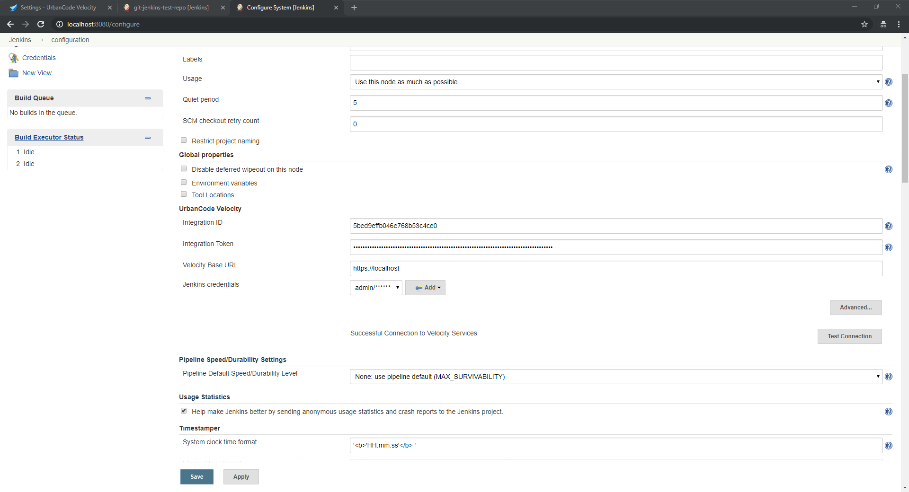
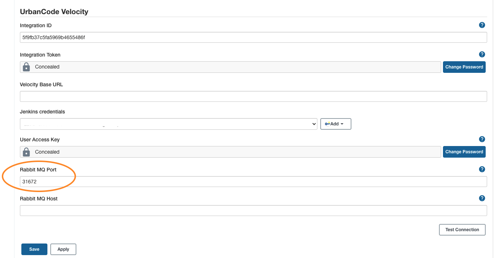

# UrbanCode Velocity Plugin
With this Jenkins plugin, you can run Jenkins jobs as a part of a deployment plan in UrbanCode Velocity. You can run jobs that will trigger the creation of a version in a Velocity Pipeline as well as persist properties on that version that can be used as input properties in other Jenkins builds. This plugin will pass along important data from Git to the Velocity Pipeline.

## Build
To build the plugin, simply run
```
mvn install
```
or
```
mvn clean package -DskipTests
```
in the root of this repository. Optionally pass the `-DskipTests` flag to speed up the build by not running the tests.

**NOTE**: Must be built with Java 8\
**NOTE**: It's best to delete the `target` directory before building to avoid errors.

## Detailed Functionality

* **Posting job metadata to your Velocity instance -** As you create and edit jobs, the metadata for the jobs will uploaded including the names of the jobs as well as the names of parameters.  This is done so that the jobs can be invoked from UrbanCode Velocity within the Velocity security model.

* **Invoke jobs from Velocity -** An authenticated, encrypted persistent connection is established with UrbanCode Velocity so that you can trigger off jobs and pipelines with no special firewall configuration.

* **Updates status of running jobs -** You will receive instant feedback in UrbanCode Velocity with links to the execution.

* **Job Executions can create versions in Velocity Pipeline -** You will have the option to select Jenkins jobs as "input jobs" which will create a version with special properties that you can specify.

* **Detects quality data provided by IBM Deployment Risk Analytics -** If you use the capabilities found in the IBM Cloud DevOps plugin to provide data to IBM DRA, then this plugin will forward that data to your composite pipeline to visualize quality data across your whole suite of applications.

## Installation

### 1. Generate an Integration Id and Integration Token

Navigate to the Settings Page of UrbanCode Velocity and select the Integrations section in the left navigation. Create a new Jenkins integration.


In the dialog box provide a logical name that represents the Jenkins instance that you are attempting to connect.  This will generate an Integration Id and Integration Token pair.  When the time comes this dialog provides "Copy to Clipboard" button on these fields.


### 2. Install this plugin on your Jenkins instance

Navigate to the plugins page on your Jenkins instance by clicking `Manage Jenkins > Manage Plugins > Available (tab)` and search for `UrbanCode Velocity Plugin`.  When located install the plugin and restart your instance when possible.

If the plugin is not available in the Jenkins publically hosted plugins, please download [urbancode-velocity.hpi](http://public.dhe.ibm.com/software/products/UrbanCode/plugins/) and upload it to your Jenkins instance by navigating to the Advanced tab on the plugins page.

### 3. Populate Jenkins Configuration with Integration Id, Integration Token, and Jenkins Credentials

Navigate to the Jenkins configuration page `Manage Jenkins > Configure System > UrbanCode Velocity (section)`.  Under the UrbanCode Velocity section paste the Integration ID and Integration Token values from Step 1 above.  Please add a credentials entry for a Jenkins user on whose behalf this plugin may access your Jenkins items.  Please `Apply` or save the values before clicking the `Test Connection` button to confirm your connection to UrbanCode Velocity.  Upon successful connection, your data will be posted to UrbanCode Velocity.



### Note

Jenkins integrations on Kubernetes/Openshift instances: When a user configures the UrabanCode Velocity plugin within Jenkins, they need to manually specify the "Rabbit MQ Port" in Jenkins  (typically 31672) since the default value (5672) will not work.



### License

Copyright&copy; 2016, 2017 IBM Corporation

Permission is hereby granted, free of charge, to any person obtaining a copy of this software and associated documentation files (the "Software"), to deal in the Software without restriction, including without limitation the rights to use, copy, modify, merge, publish, distribute, sublicense, and/or sell copies of the Software, and to permit persons to whom the Software is furnished to do so, subject to the following conditions:

The above copyright notice and this permission notice shall be included in all copies or substantial portions of the Software.

THE SOFTWARE IS PROVIDED "AS IS", WITHOUT WARRANTY OF ANY KIND, EXPRESS OR IMPLIED, INCLUDING BUT NOT LIMITED TO THE WARRANTIES OF MERCHANTABILITY, FITNESS FOR A PARTICULAR PURPOSE AND NONINFRINGEMENT. IN NO EVENT SHALL THE AUTHORS OR COPYRIGHT HOLDERS BE LIABLE FOR ANY CLAIM, DAMAGES OR OTHER LIABILITY, WHETHER IN AN ACTION OF CONTRACT, TORT OR OTHERWISE, ARISING FROM, OUT OF OR IN CONNECTION WITH THE SOFTWARE OR THE USE OR OTHER DEALINGS IN THE SOFTWARE.

